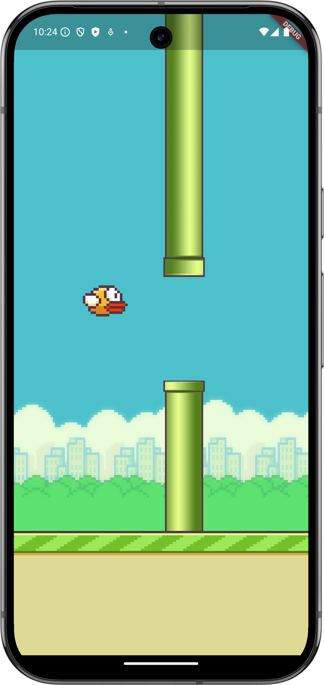

# Flappy Bird



Flappy Bird - это новая игра, созданная с использованием Flutter и Flame. Ваша цель - управлять птицей, избегая препятствий и набирая очки.

## 🚀 Начало работы

Этот проект является отправной точкой для создания приложения на Flutter.

### 📚 Ресурсы для начала

Если это ваш первый проект на Flutter, вот несколько ресурсов, которые помогут вам начать:

- [Лаборатория: Напишите свое первое приложение на Flutter](https://docs.flutter.dev/get-started/codelab)
- [Книга рецептов: Полезные примеры Flutter](https://docs.flutter.dev/cookbook)

Для получения помощи по началу разработки на Flutter, ознакомьтесь с [онлайн документацией](https://docs.flutter.dev/), которая предлагает учебные пособия, примеры, руководство по мобильной разработке и полный API-справочник.

## 📦 Установка

1. Убедитесь, что у вас установлены Flutter и Dart SDK.
2. Клонируйте репозиторий:
    ```sh
    git clone https://github.com/yourusername/flappy_bird.git
    ```
3. Перейдите в директорию проекта:
    ```sh
    cd flappy_bird
    ```
4. Установите зависимости:
    ```sh
    flutter pub get
    ```

## 🕹️ Запуск игры

Для запуска игры на вашем устройстве или эмуляторе, выполните следующую команду:
```sh
flutter run
